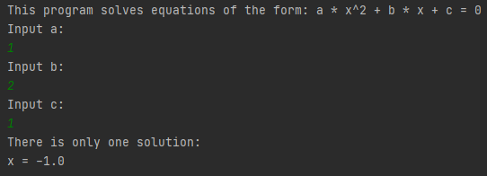
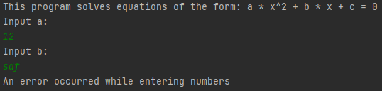
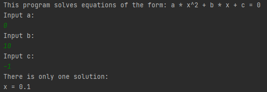
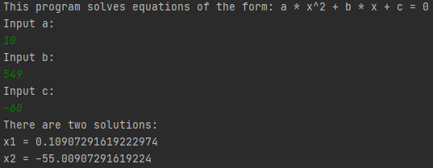
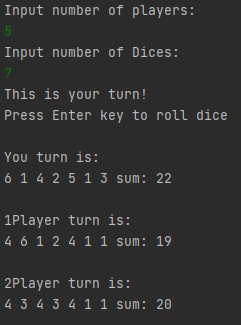
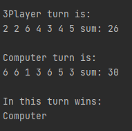
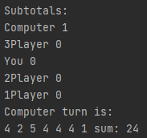
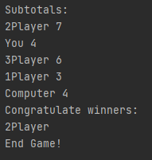

# Отчет по Учебному практическому заданию 1  
  
## Задание №1.

"Разработайте класс для решения квадратных уравнений. Вычисление дискриминанта должен осуществлять вложенный класс. После компиляции объясните структуру class файлов.   
Проанализируйте использование вложенного класса."

### Описание программы:

    Программа решает квадратные уравнения вида: a * x ^ 2 + b * x + c = 0.  
    Коэффициенты уравнения передаются через консоль. Прогамма решает уравнения в поле действительных чисел.  
    В случае комплексных корней программа выдает: "Нет корней".

    
### Структура программы:  
* Класс Main
    * Обработка входных данных, вызов метода решающего квадратное уравнение  
* Класс EquationSolver
    * Содержит метод getSolver, который решает квадратное уравнение и возвращает List<Double> с корнями уравнения.
    
### Примеры работы

P. S. Не понял зачем было создавать вложенный класс. Я бы просто сделал метод getDiscriminant. Вероятно, что моя реализация с вложенным классом не имеет смысла, но ничего лучше не придумал.

## Задание №2.

"Реализуйте игру в кости. Играют N игроков (компьютер в списке последний). Кидается одновременно К кубиков.
Выигрывает тот, у кого большая сумма очков. Кто выиграл, тот и кидает первым в следующем кону. Игра идет до 7 выигрышей. Начинаете игру Вы."  

### Описание программы:

Программа имитирует игру в кости. Вы можете "бросить кости" за игрока с ником "You". Остальные игроки ходят автоматически.  
После каждого раунда печатаются ники победителей, а так же промежуточные результаты.  

### Структура программы:  
* Класс Main
    * Обработка входных данных, вызов метода запускающего игру  
* Класс Player
    * Класс описывающий игрока в кости. Перегружен метод compareTo таким образом, чтобы игроки ходили в соответствии с местами, которые они заняли в прошлом раунде.  
* Класс DiceRoller
    * Содержит реализацию игры в кости 

### Примеры работы

## Задание №3.  
"Напишите программу «Адрес человека». Есть сущность Человек, которая связана с сущностью Адрес. Считается, что у каждого человека есть только один адрес. Организовать массив объектов Человек (не менее 4) и по массиву:  
* осуществить поиск Человека по фамилии;  
* осуществить поиск человека по атрибуту адреса;  
* вывести людей, родившихся между определенными датами;  
* найти самого старого (молодого);  
* найти людей, проживающих на одной улице."  

### Описание программы:  
В программе реализована простейшая адресная книга. В ней Имя, Фамилия, Дата Рождения, а также Адрес. 
Перед началом работы с адресной книгой ее необходимо заполнит, через файл "source/addressBook.txt".
Каждая строка в этом файле - отдельная запись в адресной книге. Пропуски полей недопустимы.
Формат строки:  
    <Имя> <Фамилия> <ДД.ММ.ГГГГ> <город> <улица> <дом> <квартира>  
Пример валидной строки:  
  "Ivan Ivanov 10.01.2013 Moscow Kosmonavtov 35 11"
    
### Структура программы:  
* Класс Main
    *  Вызов методов класса AddressBook  
* Класс Address  
    * Описывает Адрес  
* Класс Human  
    * Описывает Человека  
* Класс AddressBook  
    * Содержит реализацию адресной книги  
